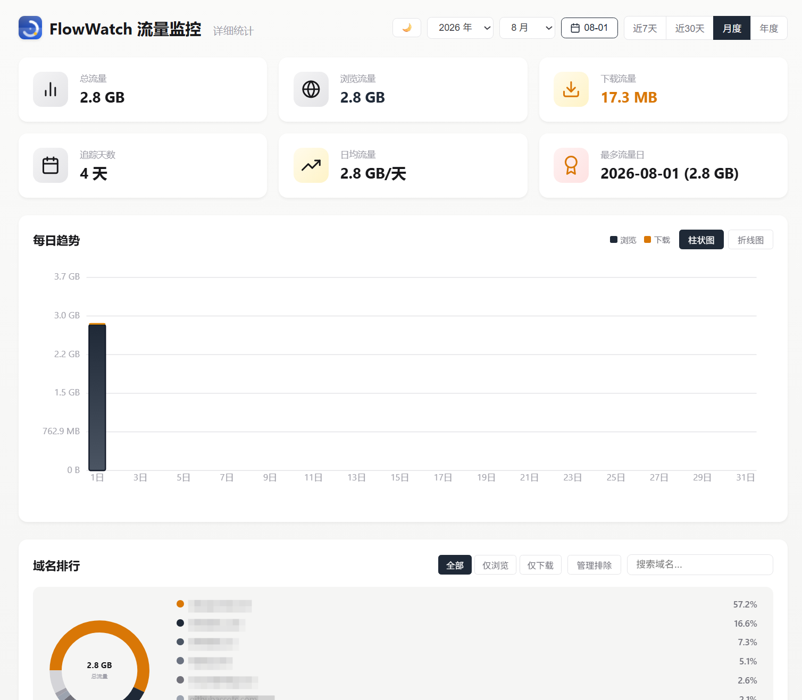
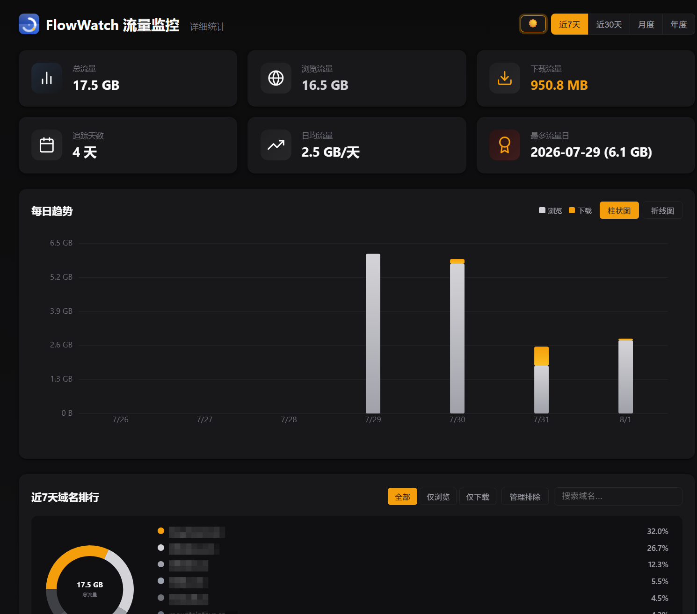

# FlowWatch 流量监控 · FlowWatch Traffic Monitor

> 按域名统计浏览/下载流量的轻量浏览器扩展。**数据 100% 本地，绝不上传。**
> A lightweight browser extension that tracks browse/download traffic by domain. **100% local — nothing is ever uploaded.**

[English](#english) | [中文](#中文) | License: [MIT](./LICENSE)

---

## 中文

### 功能

- 📊 **流量统计** — 按域名统计浏览和下载流量，实时采集
- 📅 **日/月/年视图** — 摘要卡片 + 每日趋势 + 域名排行，日历选择器按日查看
- 📈 **SVG 图表** — 柱状图/折线图切换，**点击柱/点直接跳转到该日统计**（hover 有原生 tooltip）
- 🔍 **域名详情** — 点击任意域名查看细分域名拆分和每日明细
- 🚫 **域名排除** — 一键排除不关心的域名（如 CDN）
- 📥 **CSV 导出** — 导出当前视图的域名流量报表
- 🌐 **智能 favicon** — 三级解析：直连 `/favicon.ico` → 主页 `<link rel=icon>` 解析 → favicon.im 兜底；内置 35+ 平台 CDN 映射（hdslb.com→bilibili、githubassets.com→github 等）
- 🌙 **暗色模式** — 跟随系统自动切换 + 手动三态开关（浅色/深色/自动）
- ✨ **动画过渡** — 数字滚动、图表生长、卡片入场，尊重系统"减少动态效果"设置

### 安装（开发者模式）

1. 下载或 clone 本仓库
2. 打开 Edge/Chrome，进入 `edge://extensions/` 或 `chrome://extensions/`
3. 开启 **"开发人员模式"** / **"Developer mode"**
4. 点击 **"加载解压缩的扩展"** / **"Load unpacked"**
5. 选择项目文件夹

### 开发

```bash
npm run check   # 全部 JS 语法检查（node --check）
npm test        # favicon 解析逻辑回归测试（19 用例）
```

GitHub Actions 会在 push/PR 时自动执行以上检查。

### 技术栈

- Manifest V3 · Service Worker
- 零框架 · 纯原生 JS + CSS 变量（暗色主题）+ 内联 SVG
- chrome.webRequest / chrome.downloads / chrome.storage

### 隐私

所有数据存储在 `chrome.storage.local`，永不上传。扩展只读取响应大小和 `content-length` 头，**从不读取请求/响应内容**。`<all_urls>` 权限仅用于统计各域名流量。

### 截图

浅色模式：



暗色模式：



---

## English

### Features

- 📊 **Traffic tracking** — Browse/download bytes per domain, collected in real time
- 📅 **Day/Month/Year views** — Summary cards, daily trends, domain rankings, calendar day picker
- 📈 **SVG charts** — Bar/line toggle; **click a bar/dot to jump to that day's stats** (native tooltip on hover)
- 🔍 **Domain details** — Subdomain breakdown and daily history for any domain
- 🚫 **Domain exclusion** — One-click exclude domains you don't care about (e.g., CDNs)
- 📥 **CSV export** — Export current view as CSV
- 🌐 **Smart favicons** — 3-level resolution: direct `/favicon.ico` → homepage `<link rel=icon>` parsing → favicon.im fallback; built-in mapping for 35+ platform CDN domains (hdslb.com→bilibili, githubassets.com→github, etc.)
- 🌙 **Dark mode** — Follows system preference with a manual light/dark/auto toggle
- ✨ **Smooth animations** — Count-up numbers, chart growth, staggered entrances; respects `prefers-reduced-motion`

### Install (Developer mode)

1. Clone or download this repo
2. Open `chrome://extensions/` or `edge://extensions/`
3. Enable **Developer mode**
4. Click **Load unpacked**
5. Select the project folder

### Development

```bash
npm run check   # syntax-check all JS files (node --check)
npm test        # favicon resolution regression tests (19 cases)
```

GitHub Actions runs both on every push/PR.

### Tech

- Manifest V3 · Service Worker
- Zero frameworks · Vanilla JS + CSS variables (dark theme) + inline SVG
- chrome.webRequest / chrome.downloads / chrome.storage

### Privacy

All data lives in `chrome.storage.local`. Nothing is ever uploaded. The extension only reads response sizes and `content-length` headers — **never request or response bodies**. The `<all_urls>` permission is used solely for per-domain traffic accounting.

### Screenshots

Light mode:


Dark mode:


